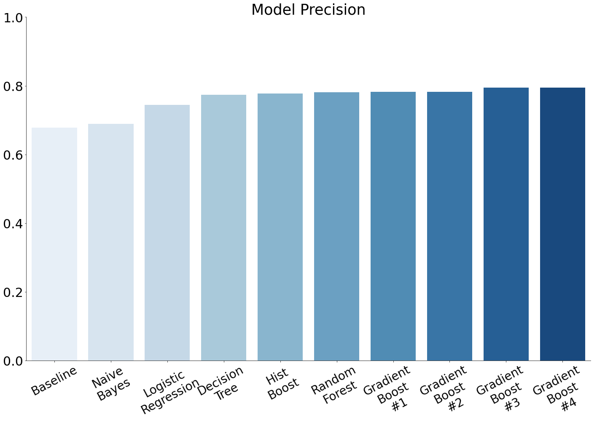
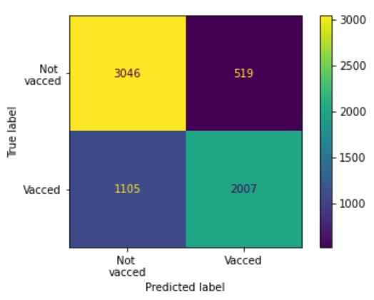

# Seasonal Flu Vaccine Prediction


**Authors**: Anthony Warren, Marcelo Scatena, Piotr Czolpik

## Overview

The goal of this project was to build a classifier to predict whether someone was vaccinated against the seasonal flu or not as accurately as possible. Flu season comes around yearly. Every year people either take the flu shot or they do not. We made splits in Age gaps, genders, children in households, etc to see the statistical side of things before we did the modeling. Also we tried to answer some questions such as which subsets of the population should you target when hoping to increase the total number of people receiving the vaccine each year. Or weather to focus more on the female or male audience, or to focus on what age group. 

* Raise awareness of dangers of the seasonal flu via new campaigns to everyone
* A more specific campaign towards folks aged below their forties could be more beneficial as they are the least likely age groups to be vaccinated
* Have doctors and practitioners reach out to patients to take the vaccine
***

## Business Problem

* Provide recommendations about what could be done to increase the number of vaccinated people
* Find out which characteristics lead people to be more or less prone to have taken the seasonal flu vaccine 
* Use that information to make targeted campaigns to raise vaccine awareness, and see what else could be done do to increase the number of vaccinated people in next campaigns
* Train and run a model that can correctly identify the likelihood that a randomly chosen individual received the seasonal flu vaccine or not
***

## Data

The information we have is from a 2009 U.S. National H1N1 Flu Survey. The features cover social, economic and demographic background of the participants, as well as opinions on risks of illnes, vaccine effectiveness, and behaviour. The full set of features can be found [here](https://www.drivendata.org/competitions/66/flu-shot-learning/page/211/). It consisted of over 26000 samples with 35 different features.
***

## Methods & Evaluation Metrics
 
 * The dataset in question does not contain any continuous variables, making it perfect for classification. There were missing values that were inputed with median values when applicable to prevent information loss, and there were Categorical values in some features, that had to be OneHotEncoded to be part of the data.

* We've constructed simple prediction models using the following methods:
  - Logistic Regression
  - K-Nearest Neighbours
  - Naive Bayes
  - Decision Trees
  - Random Forest
  - Gradient Boost
  - Hist Gradient Boost

We chose precision as our main evaluation metric for our models over recall because, given any amount of incorrect predictions, we’d rather focus on the ones where the individual have not received the vaccine but the model predicts they did (false positives) over those the model predicted didn’t receive the vaccines, but did (false negatives).
The tradeoff for getting higher in Precision though, is that you may have to sacrifice Accuracy to do so. Because of that, we didn't simply chose models that have the higher Precision score, but only did so if they had an Accuracy above 75%.

***

## Results

* Since the chosen evaluation metric was Precision, we've create a graph recording our progress with the different models:



* The Feature Permutation shows how important each feature was for the model to generate a prediction. Here we selected the seven most important ones to display.


* Below is the Confusion Matrix of our most successful model, the tuned Gradient Boosting Classifier. With it we achieved a Precision of around 79% with an Accuracy of around 75%.



* Since age group is one of our most important features for predicting wheter an individual has taken the vaccine, we also looked into which percentage each group has taken the vaccine.


***

## Conclusions

Given all the information we modeled, the recommendations we have are:
***
* Personal Opinions Matters
  - Raise awareness of dangers of the seasonal flu via new campaigns to everyone. Peoples own opinions about the risks of the flu are highly correlated with them getting the vaccine or not. New campaigns talking about the risks could have a positive effect in vaccination rollout.
* Age Matters
  - A more specific campaign towards folks aged below their mid thirties could be more beneficial as they are the least likely age group to be vaccinated. We reccomend campaings that target that group more specifically, since they'll be targeting a larger non vaccinated audience.
* Professional Opinions Matters
  - Lastly, have doctors and practitioners reach out to patients to take the vaccine. People tend to listen to their doctors. We suggest communicating to doctors about proactive campaigns, be it via email or telephone,where practitioners reach out to patients to comunicate the importance of the vaccine.
***
## For More Information

Please review our full analysis in [our Jupyter Notebook](./final_notebook.ipynb) or our [presentation](./final_presentation.pdf).

For any additional questions, please contact<br />
**Anthony Warren: anthonywarren6@gmail.com**<br />
**Marcelo Scatena: marcelo.oddo@gmail.com**<br />
**Piotr Czolpik: Piotrczo1992@gmail.com**<br />

## Repository Structure


```
├── README.md                           
├── final_notebook.ipynb   
├── final_presentation.pdf         
├── data                                
└── images                              
```
